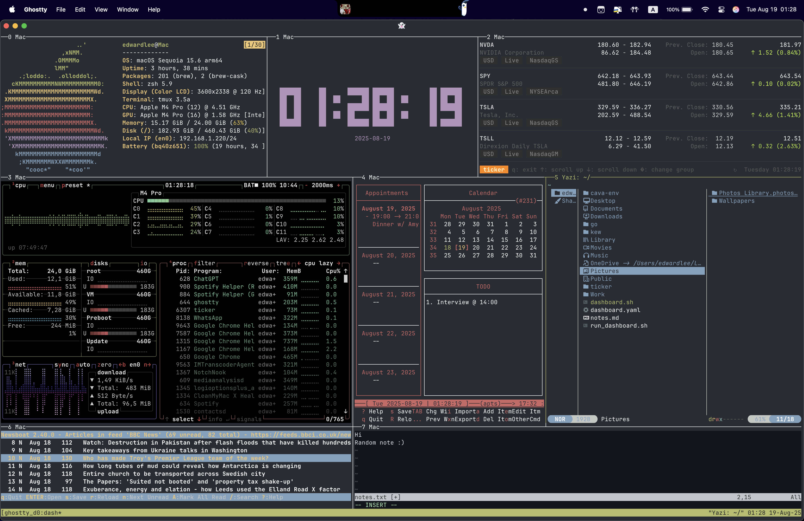

# Ghostty Terminal Dashboard

A minimal, beautiful, and powerful terminal dashboard powered by [Ghostty](https://github.com/wez/ghostty), `tmux`, and a curated set of CLI tools. Designed for developers and productivity enthusiasts who live in the terminal.

---

## 🖥️ Layout Overview
```bash
+––––––––——————–––+–––––––———–––––––––––––+–––––––––––––––––+
|   fastfetch     | tty-clock (center)    | ticker (stocks) |
+––––––––––––––––+––––––––––––––––––––+–––––––––––––––––––––+
| btop (metrics) | calcurse (agenda)  | yazi (file manager) |
+––––––––––––––—————————————–+–––––––—————————––––––––––––+
|       newsboat (RSS)       |         nvim (notes)         |
+————————————————————————————+——————————————————————————————+
```
---

## 🚀 Getting Started

### 1. **Install Dependencies**

Install all required CLI tools with Homebrew:

```bash
brew install \
  fastfetch \
  tty-clock \
  ticker \
  btop \
  calcurse \
  yazi \
  newsboat \
  neovim \
  tmux
```

⸻

### 2. Clone & Run
Create the script file:
```bash
nano ~/ghostty_dash.sh
```
Paste the following and make it executable:
```bash
chmod +x ~/ghostty_dash.sh
```
Then run:
```bash
~/ghostty_dash.sh
```

⸻

### 🧩 Script Breakdown

Here’s what each pane runs in your tmux session:

Pane    Tool    Description
0    fastfetch    System info with ASCII logo
1    tty-clock    Large digital clock
2    ticker    Real-time stock tracker
3    btop    System resource monitor (CPU, RAM, etc.)
4    calcurse    Interactive calendar/agenda
5    yazi    TUI file manager for browsing Documents
6    newsboat    RSS feed reader
7    nvim    Notes editor (~/notes.txt)


⸻

📅 Agenda Integration

Customize calcurse with your events or sync it with a CalDAV service for productivity integration:
```bash
nano ~/.calcurse/notes/
```

⸻

### 📰 RSS Feed Setup

Add your favorite RSS feeds to ~/.newsboat/urls:

https://feeds.bbci.co.uk/news/rss.xml BBC News
https://www.theverge.com/rss/index.xml The Verge


⸻

### ⚙️ Configuration Files

Make it yours:
    •    ~/.tmux.conf: Tmux configuration
    •    ~/.config/ticker/ticker.yaml: Stock watchlist
    •    ~/.config/yazi/config.toml: File manager config
    •    ~/.newsboat/urls: RSS subscriptions

⸻

### 🧼 Optional Improvements
    •    Use tmux-resurrect or tmuxinator to auto-restore layout
    •    Swap fastfetch with neofetch or macchina
    •    Add spotify-tui for music controls
    •    Include a gotop/nvtop GPU pane (if applicable)

⸻

### 🎯 Final Thoughts

This setup is ideal for:
    •    Developers
    •    System admins
    •    Terminal nerds who want it all on one screen

No browser, no distractions — just code, info, and flow.

⸻

📸 Screenshot


⸻

🛠 Maintained by Edward Lee
🐚 macOS Sequoia 15.6 | Ghostty | zsh | tmux

---

